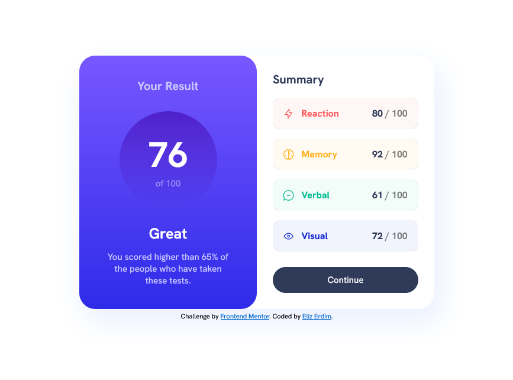

# Frontend Mentor - Results summary component solution

This is a solution to the [Results summary component challenge on Frontend Mentor](https://www.frontendmentor.io/challenges/results-summary-component-CE_K6s0maV).

## Table of contents

- [Overview](#overview)
  - [The challenge](#the-challenge)
  - [Screenshot](#screenshot)
  - [Links](#links)
- [My process](#my-process)
  - [Built with](#built-with)
  - [What I learned](#what-i-learned)
  - [Continued development](#continued-development)
  - [Useful resources](#useful-resources)

## Overview

### The challenge

Users should be able to:

- View the optimal layout for the interface depending on their device's screen size
- See hover and focus states for all interactive elements on the page

### Screenshot



### Links

- [View Code](https://github.com/elizerdim/results-summary-component)
- [Live Preview](https://elizerdim.github.io/results-summary-component)

## My process

### Built with

- Semantic HTML5 markup
- CSS custom properties
- Flexbox
- Mobile-first workflow

### What I learned

- I learned more about BEM naming convention, specifically about naming grandchildren of a block element. At the beginning, I chained their names, but it felt wrong so I did some research and found a useful article about this topic, which is linked below in the Useful resources section. I learned about why their names shouldn't be chained and saw how practical this approach is while doing this project.

- I learned how to use custom fonts with @font-face rule in CSS and did some reading on static vs. variable fonts.

- I had a chance to practice custom properties in CSS.

- I spent a long time on figuring out how to add corner borders to the list items in the summary section. I found an amazing solution on Stack Overflow (linked below in the Useful resources section), which lead me to play around with CSS masking and radial and conic gradients for hours. In the end, the transparent background of my elements did not allow me to use that solution, so I settled on this box shadow trick with a negative spread value: 

```css
.summary-section__list-item {
    list-style: none;
    font-size: 1.6rem;
    padding: 1em;
    margin-top: 1em; 
    border-radius: 15px;
    box-shadow: 
        3px 3px 0 -3px var(--dark-gray-blue-transparent),
        3px -3px 0 -3px var(--dark-gray-blue-transparent),
        -3px -3px 0 -3px var(--dark-gray-blue-transparent),
        -3px 3px 0 -3px var(--dark-gray-blue-transparent);
    display: flex;
    align-items: center;
}
```

### Continued development

I want to learn more about variable fonts and their animation possibilities. I also want to use CSS masking and get more practice with gradients in future projects.

### Useful resources

- [BEM Grandchildren: How To Handle Deeply Nested Elements](https://scalablecss.com/bem-nesting-grandchild-elements/) - This helped me understand why the names of deeply nested elements should not be chained. This pattern really made sense to me and I will use it going forward.
- [Variable Fonts vs. Static Fonts](https://www.browserstack.com/guide/variable-fonts-vs-static-fonts) - An intro to static vs. variable fonts in CSS. 
- [Corner Borders in CSS](https://stackoverflow.com/questions/14387690/how-can-i-show-only-corner-borders) - There are plenty of good answers on this Stack Overflow page to achieve border corners with various styles.